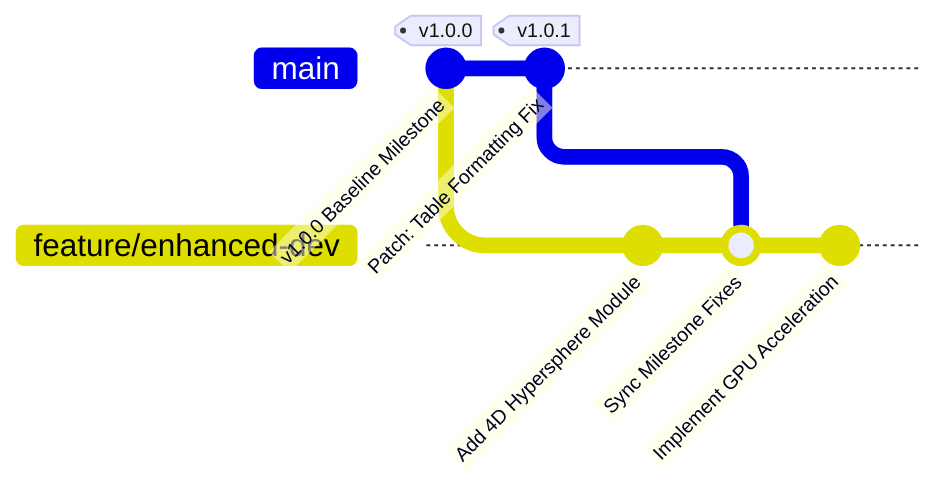

# Proposal: Revision Tracking & Branching Strategy for Enhanced Development

## 1. Executive Summary
This proposal establishes a revision tracking strategy for the `spd-analysis` project. The goal is to preserve the current stable milestone (Fibonacci, Saff-Kuijlaars, Kogan comparison and Colab-compatible Jupyter notebook) while allowing active work on enhanced features (e.g., higher-dimensional distributions, new algorithms, advanced visualization tools) in a separate development branch.

---

## 2. Proposed Branch Structure



### Key Branches:
1. **`main` (Milestone Baseline & Maintenance)**
   - **Purpose:** Serves as the stable, publication/submission-ready baseline.
   - **Content:** Core 3D point distribution algorithms, metrics, and Colab-enabled Jupyter notebook.
   - **Allowed Changes:** Critical bug fixes, documentation clarifications, and minor UI/formatting updates.
   - **Tags:** Milestone tags like `v1.0.0`, `v1.0.1` (semantic versioning).

2. **`feature/enhanced-dev` (Enhanced Development)**
   - **Purpose:** Incubates new algorithms, experimental metrics, performance enhancements, and expanded research.
   - **Content:** All core features plus experimental extensions without risking stability of the milestone.
   - **Integration:** Periodically pulls or cherry-picks stable improvements from `main`.

---

## 3. Workflow Procedures

### A. Applying Minor Improvements / Patches to the Milestone (`main`)
When a bug fix, styling update, or minor documentation tweak is needed for the current milestone:

```bash
# 1. Ensure you are on main
git checkout main

# 2. Make and commit your minor improvement
git add .
git commit -m "fix(notebook): adjust table border contrast and add tooltip"

# 3. Tag patch release if applicable
git tag -a v1.0.1 -m "Patch release v1.0.1"

# 4. Push changes and tags to GitHub
git push origin main --tags
```

### B. Developing Enhanced Features (`feature/enhanced-dev`)
For creating and working on new, advanced features:

```bash
# 1. Create and switch to the enhancement branch from main
git checkout main
git checkout -b feature/enhanced-dev

# 2. Push enhancement branch to GitHub
git push -u origin feature/enhanced-dev

# 3. Commit new experimental features
git add .
git commit -m "feat(algorithms): add HEALPix spherical partitioning"
git push
```

### C. Synchronizing Milestone Patches into Enhanced Branch
To incorporate fixes from `main` into `feature/enhanced-dev` without losing work:

```bash
# Switch to enhanced branch and merge main updates
git checkout feature/enhanced-dev
git merge main -m "merge: sync v1.0.1 milestone patches into feature/enhanced-dev"
git push
```

---

## 4. Summary Matrix

| Task Type | Target Branch | Tagging / Versioning | Merge Rule |
| :--- | :--- | :--- | :--- |
| **Milestone Hotfixes / Minor Adjustments** | `main` | `v1.0.x` (e.g. `v1.0.1`) | Direct commit or fast-forward merge |
| **New Features & Algorithms** | `feature/enhanced-dev` | `v1.1.0-alpha` (optional) | Isolated feature branch |
| **Milestone Sync into Dev** | `feature/enhanced-dev` | N/A | `git merge main` |

---

## 5. Next Steps
Upon approval of this strategy:
1. Tag current commit on `main` as `v1.0.0` (`git tag -a v1.0.0 -m "Milestone: Spherical Point Distribution Analysis v1.0.0"`).
2. Create and push `feature/enhanced-dev` branch to GitHub.
